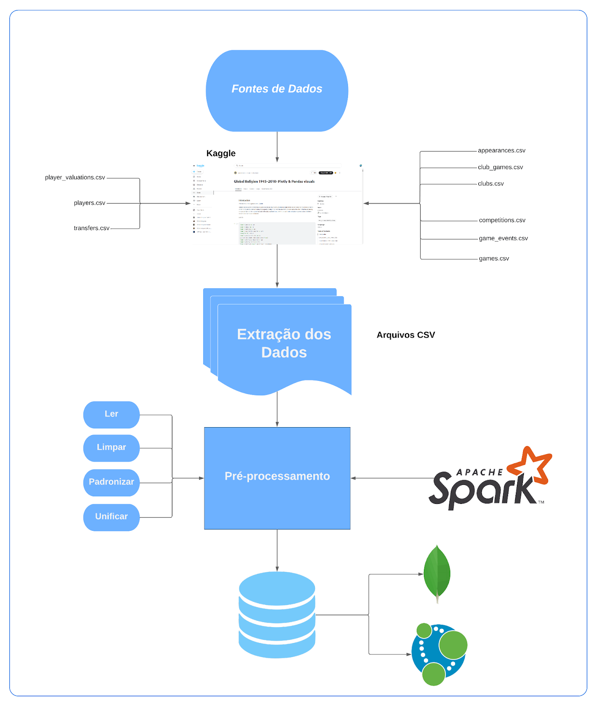

# Universidade Federal de São Carlos  
## Disciplina — Processamento Massivo de Dados (2025)

**João Vitor Averaldo Antunes · RA 813979**  
**Pedro Enrico Barchi Nogueira · RA 813099**  
**Rafael Mori Pinheiro · RA 813851**

---

## Sumário

1. [Introdução](#1-introdução)  
2. [Objetivos do Projeto](#2-objetivos-do-projeto)  
   - [Eixo 1 – Valor de Mercado & Transferências](#21-eixo-1-evolução-do-valor-de-mercado-e-impacto-das-transferências)  
   - [Eixo 2 – Escalações & Substituições](#22-eixo-2-impacto-das-escalações-e-substituições-no-desempenho-do-time)  
   - [Eixo 3 – Trajetória de Jogadores](#23-eixo-3-análise-da-carreira-e-padrões-de-trajetória-de-jogadores)  
3. [Fonte de Dados](#3-fonte-de-dados)  
4. [Tecnologias Escolhidas e Justificativas](#4-tecnologias-escolhidas-e-justificativas)  
   - [Apache Spark](#41-apache-spark)  
   - [MongoDB](#42-mongodb)  
   - [Neo4j](#43-neo4j)  
5. [Arquitetura e Fluxograma de Dados](#5-arquitetura-e-fluxograma-de-dados)  
   - [Fluxograma de Dados](#51-fluxograma-de-dados)  
   - [Descrição do Fluxo](#52-descrição-do-fluxo)  
6. [Fontes e Referências Bibliográficas](#6-fontes-e-referências-bibliográficas)

---

## 1. Introdução

O futebol moderno é uma indústria multibilionária na qual **dados** se tornam um ativo estratégico para clubes, investidores e mídia. Decisões sobre contratações, táticas e desenvolvimento de atletas são cada vez mais orientadas por análise de dados.  
Entretanto, a combinação de **variedade** (valor de mercado, eventos de jogo, histórico de transferências) e **volume** (milhões de registros) impõe desafios computacionais.

Este projeto propõe a construção de um **pipeline completo** — ingestão ▶ processamento ▶ armazenamento ▶ análise — sobre o dataset _Transfermarkt_, explorando:

- Valorização de jogadores  
- Impacto tático de escalações e substituições  
- Trajetórias e padrões de transferências  

Para lidar com escala e complexidade, adotamos **Apache Spark** para processamento distribuído, **MongoDB** para armazenamento documental e **Neo4j** para consultas baseadas em grafos.

---

## 2. Objetivos do Projeto

O objetivo geral é desenvolver uma solução que cubra todas as etapas de ETL e possibilite **insights** difíceis de se obter por métodos tradicionais.  
Dividimos em **três eixos** analíticos:

### 2.1 Eixo 1 – Evolução do Valor de Mercado e Impacto das Transferências

- Correlacionar **idade**, **desempenho** (gols, assistências, minutos) e **valorização**.  
- Identificar ligas/clubes que mais **inflacionam** o valor de mercado.  
- Calcular **ROI** de transferências específicas (custo vs. valorização vs. performance).

### 2.2 Eixo 2 – Impacto das Escalações e Substituições no Desempenho do Time

- Avaliar eficácia de **formações táticas** em probabilidade de vitória, gols marcados/sofridos.  
- Medir impacto temporal de **substituições** (ex.: gols após a troca).  
- Comparar contribuição de **titulares vs. reservas**.

### 2.3 Eixo 3 – Análise da Carreira e Padrões de Trajetória de Jogadores

- Mapear trajetórias completas (linha do tempo clubes × datas).  
- Detectar rotas comuns (ex.: _Brasil → Portugal → Inglaterra_).  
- Descobrir **clusters** de clubes que mais negociam entre si.

---

## 3. Fonte de Dados

Utilizamos o dataset **[Player Scores from Transfermarkt](https://www.kaggle.com/datasets/davidcariboo/player-scores)**:

| Arquivo (CSV)        | Conteúdo                                           |
|----------------------|----------------------------------------------------|
| `players.csv`        | Dados pessoais e IDs dos jogadores (≈ 30 k)        |
| `player_valuations.csv` | Série temporal de valor de mercado (≈ 400 k linhas) |
| `transfers.csv`      | Histórico de transferências                        |
| `appearances.csv`    | Participações em jogos (≈ 1,2 MM registros)        |
| `games.csv` + outros | Metadados e eventos de partidas                    |

---

## 4. Tecnologias Escolhidas e Justificativas

### 4.1 Apache Spark

| Uso | Justificativa |
|-----|---------------|
| **ETL distribuído** | Leitura de múltiplos CSVs, limpeza de dados e conversão de tipos em paralelo. |
| **Joins em larga escala** | Cruzamento de `players`, `valuations`, `appearances`, `games` sem sobrecarregar fonte de dados. |
| **Cálculos pesados** | Pré-cálculo de estatísticas de carreira, médias, desvio padrão etc. |

### 4.2 MongoDB

| Papel | Vantagem |
|-------|----------|
| **Perfil de Jogador** | Documento único contendo dados pessoais, estatísticas resumidas e série temporal de valor. |
| **Dados de Jogos** | Cada partida como documento com lista de eventos/jogadores. |
| **Esquema flexível** | Fácil adicionar campos futuros (redes sociais, prêmios). |

### 4.3 Neo4j

| Uso | Benefício |
|-----|-----------|
| **Trajetória de Carreira** | Modelagem natural em grafo (Jogador ⇄ Clube ⇄ País). |
| **Padrões e Rotas** | Consultas Cypher simples para “fluxo Brasil → Europa” ou “clubes que mais transferem entre si”. |

---

## 5. Arquitetura e Fluxograma de Dados

### 5.1 Fluxograma de Dados

> _Fig. 1 – Pipeline resumido: ingestão (Kaggle CSV) → ETL no Spark → Carga em MongoDB/Neo4j._

### 5.2 Descrição do Fluxo

| Etapa | Descrição |
|-------|-----------|
| **Ingestão & Processamento (Spark)** | Leitura de CSV, ETL, joins e estatísticas agregadas. |
| **Carga (Spark Connectors)** | - Escreve documentos JSON no MongoDB. - Cria nós e arestas em Neo4j. |
| **Análise & Consulta** | - Eixos 1 & 2 via MongoDB (perfis, jogos). - Eixo 3 via Neo4j (redes de transferência). |

---

## 6. Fontes e Referências Bibliográficas

1. Kaggle – **Player Scores from Transfermarkt**  
   <https://www.kaggle.com/datasets/davidcariboo/player-scores>  
2. MongoDB Manual  
   <https://www.mongodb.com/docs/manual/>  
3. MongoDB Spark Connector  
   <https://www.mongodb.com/docs/spark-connector/current/>  
4. Neo4j Documentation  
   <https://neo4j.com/docs/>  
5. Neo4j + Spark Connector  
   <https://neo4j.com/developer/spark/>  
6. Apache Spark Documentation  
   <https://spark.apache.org/docs/latest/>

---
